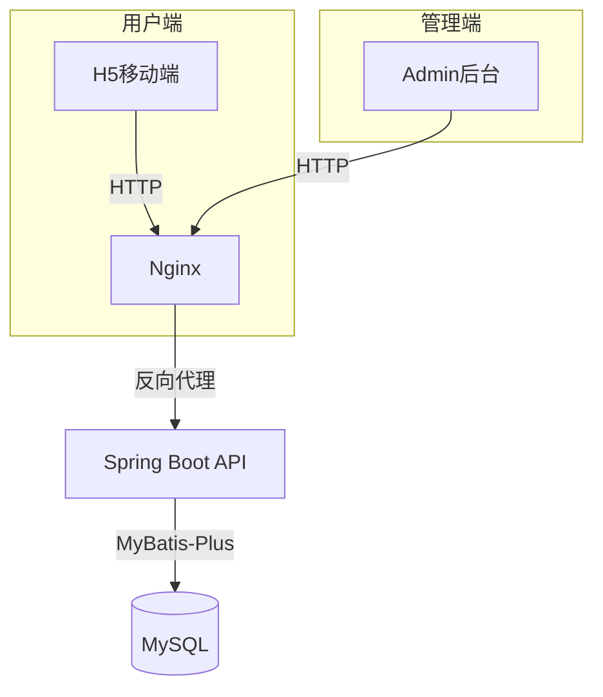
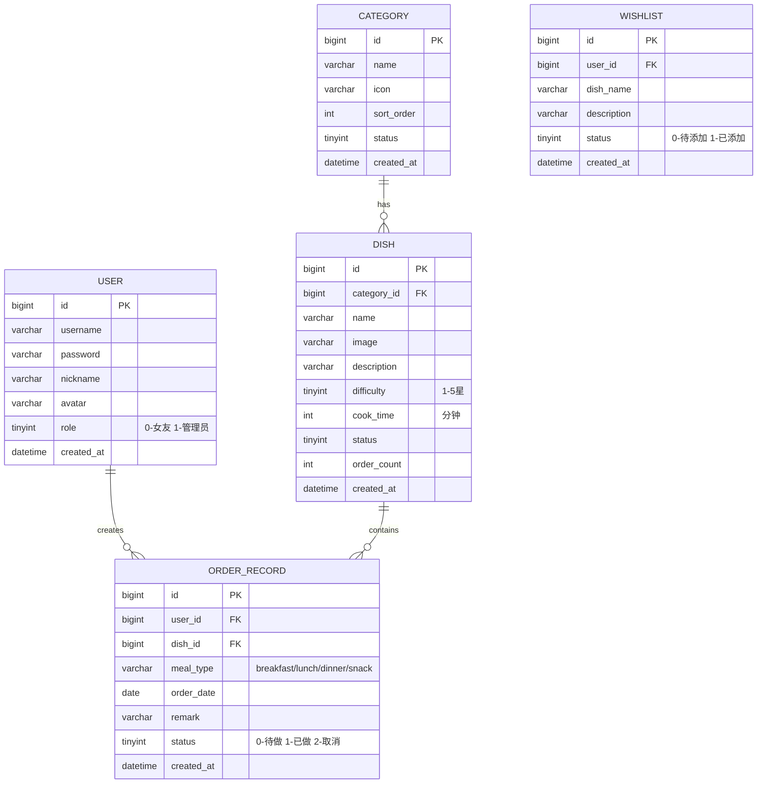

# 女友点餐系统 - 项目设计文档

## 1. 项目概述

一个专为情侣设计的每日点餐应用，男生可以在后台管理菜品，女友通过H5页面轻松选择今天想吃什么。

### 1.1 核心功能

**管理后台 (frontend-admin)**
- 菜品管理：添加、编辑、删除菜品
- 分类管理：早餐、午餐、晚餐、夜宵、甜点等
- 点餐记录：查看女友的点餐历史
- 数据统计：最爱吃的菜品排行

**用户端 H5 (frontend-user)**
- 今日点餐：滑动卡片选择想吃的菜
- 随机推荐：不知道吃什么时随机推荐
- 点餐历史：查看自己的点餐记录
- 心愿清单：想吃但还没做的菜

## 2. 系统架构



## 3. 数据库设计



## 4. API 接口清单

### 4.1 认证模块 `/api/auth`
| 方法 | 路径 | 描述 |
|------|------|------|
| POST | /login | 用户登录 |
| POST | /logout | 退出登录 |
| GET | /info | 获取当前用户信息 |

### 4.2 分类模块 `/api/category`
| 方法 | 路径 | 描述 |
|------|------|------|
| GET | /list | 获取分类列表 |
| POST | /save | 新增/编辑分类 |
| DELETE | /{id} | 删除分类 |

### 4.3 菜品模块 `/api/dish`
| 方法 | 路径 | 描述 |
|------|------|------|
| GET | /list | 分页查询菜品 |
| GET | /random | 随机推荐菜品 |
| GET | /{id} | 获取菜品详情 |
| POST | /save | 新增/编辑菜品 |
| DELETE | /{id} | 删除菜品 |

### 4.4 点餐模块 `/api/order`
| 方法 | 路径 | 描述 |
|------|------|------|
| GET | /list | 查询点餐记录 |
| GET | /today | 获取今日点餐 |
| POST | /save | 提交点餐 |
| PUT | /status/{id} | 更新状态 |
| GET | /stats | 点餐统计 |

### 4.5 心愿单模块 `/api/wishlist`
| 方法 | 路径 | 描述 |
|------|------|------|
| GET | /list | 获取心愿列表 |
| POST | /save | 添加心愿 |
| DELETE | /{id} | 删除心愿 |

## 5. UI/UX 设计规范

### 5.1 色彩系统
```scss
// 主色调 - 温暖粉色系
$primary-color: #FF6B9D;      // 主色
$primary-light: #FFB6C1;      // 浅粉
$primary-dark: #E91E63;       // 深粉

// 辅助色
$success-color: #67C23A;      // 成功绿
$warning-color: #FFAB40;      // 警告橙
$danger-color: #F56C6C;       // 危险红
$info-color: #909399;         // 信息灰

// 背景色
$bg-color: #FFF5F7;           // 页面背景
$card-bg: #FFFFFF;            // 卡片背景
$hover-bg: #FFF0F3;           // 悬浮背景

// 文字色
$text-primary: #303133;       // 主要文字
$text-regular: #606266;       // 常规文字
$text-secondary: #909399;     // 次要文字
$text-placeholder: #C0C4CC;   // 占位文字
```

### 5.2 字体规范
```scss
$font-family: -apple-system, BlinkMacSystemFont, 'Segoe UI', Roboto, 'PingFang SC', 'Microsoft YaHei', sans-serif;

$font-size-xs: 12px;
$font-size-sm: 13px;
$font-size-base: 14px;
$font-size-md: 16px;
$font-size-lg: 18px;
$font-size-xl: 20px;
$font-size-xxl: 24px;
```

### 5.3 间距与圆角
```scss
// 间距
$spacing-xs: 4px;
$spacing-sm: 8px;
$spacing-md: 16px;
$spacing-lg: 24px;
$spacing-xl: 32px;

// 圆角
$radius-sm: 4px;
$radius-md: 8px;
$radius-lg: 12px;
$radius-xl: 16px;
$radius-round: 50%;
```

### 5.4 阴影
```scss
$shadow-sm: 0 2px 4px rgba(255, 107, 157, 0.1);
$shadow-md: 0 4px 12px rgba(255, 107, 157, 0.15);
$shadow-lg: 0 8px 24px rgba(255, 107, 157, 0.2);
```

## 6. 项目结构

```
girlfriend-menu/
├── backend/                    # Spring Boot 后端
│   ├── src/main/java/com/menu/
│   │   ├── GirlfriendMenuApplication.java
│   │   ├── config/            # 配置类
│   │   ├── controller/        # 控制器
│   │   ├── service/           # 服务层
│   │   ├── mapper/            # MyBatis Mapper
│   │   ├── entity/            # 实体类
│   │   ├── dto/               # 数据传输对象
│   │   ├── vo/                # 视图对象
│   │   ├── common/            # 公共类
│   │   └── exception/         # 异常处理
│   ├── src/main/resources/
│   │   ├── application.yml
│   │   └── schema.sql
│   ├── Dockerfile
│   └── pom.xml
├── frontend-admin/            # Vue3 管理后台
│   ├── src/
│   │   ├── api/
│   │   ├── stores/
│   │   ├── views/
│   │   ├── components/
│   │   └── styles/
│   ├── Dockerfile
│   └── package.json
├── frontend-user/             # Vue3 H5用户端
│   ├── src/
│   │   ├── api/
│   │   ├── stores/
│   │   ├── views/
│   │   ├── components/
│   │   └── styles/
│   ├── Dockerfile
│   └── package.json
├── docker-compose.yml
├── .gitignore
└── README.md
```
